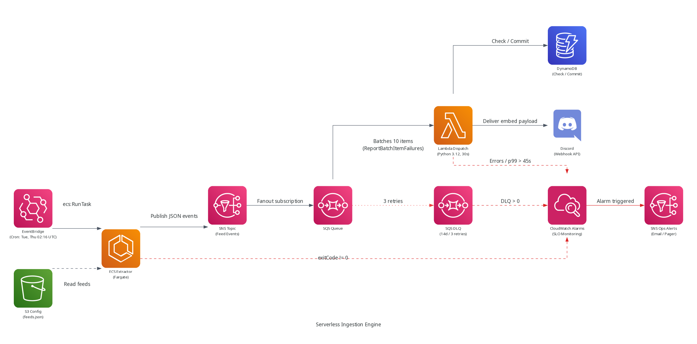

# Serverless Ingestion Engine

Serverless Ingestion Engine is an automated, event-driven distributed ingestion and dispatch engine built with Python, OpenTofu, Amazon ECS Fargate, SNS, SQS, AWS Lambda, Amazon DynamoDB, and Discord Webhooks.

The platform demonstrates an enterprise cloud infrastructure loop: scheduled containerized ingestion parses and normalizes upstream sources, decoupled pub/sub messaging buffers high-volume burst ingestion, a check-first database layer guarantees idempotent delivery, and dedicated CloudWatch observability modules monitor runtime Service Level Objectives (SLOs) with zero fixed idle infrastructure.

## Architecture

The engine processes events and coordinates state through isolated operational stages:

| Path | Purpose | Flow |
| :--- | :--- | :--- |
| **Ingestion Adapter** | Run concurrent ingestion in public subnets with zero NAT Gateways | EventBridge -> ECS Fargate -> S3 |
| **Decoupled Fan-Out** | Buffer ingestion bursts and isolate downstream rate limits | ECS Extractor -> SNS Topic -> SQS Queue |
| **Poison-Pill Quarantine** | Isolate unprocessable events for diagnostic inspection | SQS Queue -> DLQ (14-day retention) |
| **Idempotent Dispatch** | Verify uniqueness and publish rich notifications | SQS -> Lambda -> DynamoDB -> Webhook |
| **SLO Observability** | Alert on queue stagnation, execution latency, and container crashes | CloudWatch Alarms & EventBridge -> SNS Topic |
| **Continuous Delivery** | Deploy container images and infrastructure via OIDC with state locks | GitHub Actions -> ECR -> OpenTofu |



## Service Level Objectives (SLOs) & Reliability

Infrastructure reliability standards are codified directly in OpenTofu (`infra/observability`) through four automated CloudWatch alerting loops:

| Objective (SLO) | Indicator (SLI) | Alert Trigger |
| :--- | :--- | :--- |
| **100% Ingestion Success** | Extractor container exit code | `containers.exitCode != 0` |
| **100% Message Durability** | SQS Dead Letter Queue count | `ApproximateNumberOfMessagesVisible > 0` |
| **< 45s Dispatch Latency** | Lambda execution duration (p99) | `Duration > 45,000 ms` |
| **99.9% Dispatch Availability** | Lambda unhandled runtime errors | `Errors > 0` |

## Tech Stack

| Layer | Tools |
| :--- | :--- |
| **Language** | Python 3.12 (`uv`) |
| **Infrastructure as Code** | OpenTofu 1.9.0 |
| **Compute** | ECS Fargate, Lambda |
| **Messaging & Storage** | SNS, SQS, DynamoDB, S3 |
| **Containerization** | Docker (Multi-stage Alpine) |
| **Observability** | CloudWatch Alarms & Metrics, EventBridge, SNS |
| **Code Quality & Security** | Pytest, Ruff, TFLint, Trivy |
| **CI/CD & Security** | GitHub Actions, AWS IAM OIDC, DynamoDB State Locking |

## Key Architectural Decisions

- **Zero-NAT Gateway Cost Control:** The ECS extractor runs in public subnets with `assign_public_ip = true` and an egress-only security group (`ingress = []`). Drops unsolicited inbound traffic at the hypervisor while avoiding fixed hourly fees from idle NAT Gateways.
- **Decoupled Buffer & Fan-Out:** SNS fan-out to SQS isolates the extractor from Discord rate limits. SQS provides a 180s visibility timeout (6x Lambda timeout) and a 3-retry threshold before quarantining poison pills in a 14-day DLQ.
- **Distributed Idempotency:** Deterministic SHA-256 URL hashing with DynamoDB check-first validation prevents duplicate Discord notifications on SQS retries (`ReportBatchItemFailures` enabled).
- **Hardened Container Profile:** Multi-stage Alpine container drops all Linux capabilities (`drop = ["ALL"]`) and mounts a read-only root filesystem as an unprivileged user (`extractoruser`, UID 10001).
- **IaC Rigor & Security Scanning:** OpenTofu remote state is protected by DynamoDB distributed state locking. CI enforces parallel quality gates across Python linting/testing, Markdown validation, TFLint policy evaluation, Trivy security scanning, and nightly infrastructure drift detection.

## Documentation

- [Documentation Hub](docs/README.md)
- [System Architecture](docs/architecture.md)
- [Docker Architecture & Benchmarks](docs/docker/README.md)

## Local Development

Test the full event-driven pipeline locally using Podman Compose and LocalStack (emulating S3, SNS, SQS, and DynamoDB offline):

```bash
# Start the stack (boots LocalStack, provisions resources, starts dispatcher)
make compose-up

# Trigger an extraction run in a separate terminal
podman compose run --rm extractor

# Inspect dispatcher logs to verify ingestion and deduplication
podman logs -f cloud-feed-pipeline-dispatcher

# Tear down the stack
make compose-down
```

## Quality Verification & Linting

Run automated unit tests, verification scripts, formatters, and code quality linters:

```bash
make lint           # Run ruff check and format inspection
make test           # Run all unit tests with pytest (20/20 passed)
make md-lint        # Lint markdown documentation files
make tofu-fmt       # Check OpenTofu formatting across all modules
make tofu-validate  # Validate root and sub-module OpenTofu configurations
```
